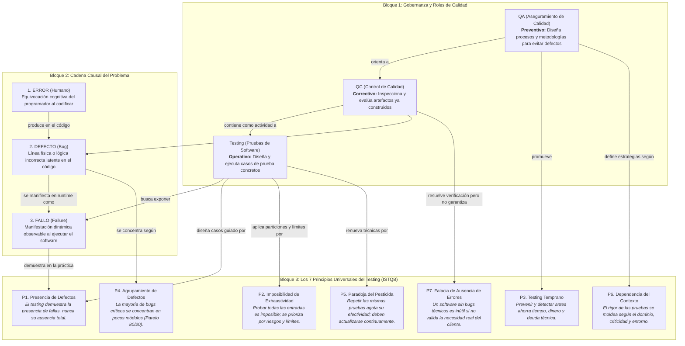

# Plan de Pruebas de Caja Negra y Diagnóstico de Defectos

## Actividad 1: Mapa Conceptual de Fundamentos de Calidad

A continuación se presenta el mapa conceptual interactivo que conecta la gobernanza de calidad (**Roles Operativos: QA vs. QC vs. Testing**), la dinámica de origen de problemas (**Cadena Error → Defecto → Fallo**) y los **7 Principios Universales del Testing de ISTQB**.
x

### Síntesis de Conexiones entre Conceptos:
1. **De la Prevención a la Ejecución (QA → QC → Testing):**  
   El **QA** instaura la política de prevención (ej. revisiones de especificaciones bajo el principio de *Testing Temprano - P3*). El **QC** revisa el producto terminado y utiliza el **Testing** como la herramienta técnica para confrontar entradas contra salidas esperadas.
2. **De la Mente al Software (Error → Defecto → Fallo):**  
   El **Error** es el desliz mental del desarrollador (ej. olvidar que un denominador no puede ser cero). Este genera un **Defecto físico** estático en el código (`presupuesto_analisis.py`). El defecto permanece inofensivo y silencioso hasta que un caso de prueba ejecuta la línea bajo condiciones de frontera, provocando un **Fallo** observable (excepción en consola o cálculo financiero erróneo).
3. **Fundamento en los Principios de ISTQB:**  
   - Dado que el *Testing exhaustivo es imposible (P2)*, utilizamos técnicas de **Caja Negra** como la **Partición de Equivalencia** y el **Análisis de Valores Límite** para seleccionar los casos con mayor probabilidad de evidenciar defectos.
   - El hecho de encontrar un fallo ratifica que *El testing muestra la presencia de defectos (P1)*.
   - Si un software cumple el 100% de los casos de prueba técnicos pero no sirve para la necesidad de negocio del cliente, cae en la *Falacia de ausencia de errores (P7)* (aprobó la Verificación, pero reprobó la Validación).

---

## Actividades 3 y 4: Plan de Pruebas de Caja Negra y Ejecución Dinámica

Las pruebas fueron diseñadas inicialmente a ciegas (Caja Negra Estática), basadas exclusivamente en los requerimientos del dominio funcional financiero y en las técnicas de **Partición de Equivalencia (EP)** y **Análisis de Valores Límite (BVA)**. Posteriormente se ejecutaron en el entorno Python 3.11 (Caja Blanca Dinámica) para auditar los resultados.

### Tabla de Casos de Prueba

| ID | Descripción | Precondición | Entrada | Resultado Esperado | Resultado Real | Estado |
| :--- | :--- | :--- | :--- | :--- | :--- | :---: |
| **CP-01** | Valor límite inferior inválido en número de socios (División por Cero) | Sistema iniciado en terminal; intérprete Python activo | `presupuesto: 1000` `socios: 0` `meses: 6` | Mensaje controlado de validación de negocio: *"El número de socios debe ser un entero mayor o igual a 1"*, solicitando reingreso sin colapsar el programa. | Excepción no controlada en terminal: `ZeroDivisionError: float division by zero` en línea 12. El programa colapsa abruptamente. | **Failed** |
| **CP-02** | Verificación de exactitud del cálculo de interés simple en período estándar | Sistema iniciado; valores en rango operativo normal | `presupuesto: 1000.0` `socios: 2` `meses: 12` | Cálculo matemático de interés simple mensual ($I = C \cdot i \cdot t$): - Intereses: **$240.00** ($1000 \cdot 0.02 \cdot 12$) - Total con intereses: **$1240.00** - Cuota por socio: **$620.00** | Cálculo inflado erróneo: - Intereses generados: **$2880.00** - Total con intereses: **$3880.00** - Cuota por socio: **$1940.00** (Desviación de +$2640.00 en intereses). | **Failed** |
| **CP-03** | Partición de equivalencia inválida: presupuesto inicial negativo | Sistema iniciado; ingreso de capital de inversión | `presupuesto: -500.0` `socios: 2` `meses: 6` | Mensaje de validación de precondición: *"El presupuesto inicial debe ser un valor positivo mayor a 0"*, impidiendo operaciones contables inconsistentes. | El programa acepta el valor negativo sin restricción: - Presupuesto inicial: **$-500.00** - Intereses generados: **$-360.00** - Total: **$-860.00** - Cuota por socio: **$-430.00** | **Failed** |

---

## Actividad 4: Reporte Técnico de Defectos (Aislamiento de Causa Raíz en Caja Blanca)

Siguiendo el estándar IEEE / ISTQB y la metodología del caso modelo del taller, se inspecciona el código fuente de `presupuesto_analisis.py` para vincular cada **Fallo** visible con su **Defecto físico (línea de código y causa raíz)**:

### Reporte de Defecto CP-01
- **Fallo observado:** El programa finaliza abruptamente emitiendo una traza de error de Python:  
  `ZeroDivisionError: float division by zero`.
- **Defecto físico:** **Línea 12:** `cuota_por_socio = total / socios`
- **Causa raíz:** Omisión de una estructura condicional de validación (`if socios <= 0: ...`). El desarrollador asumió que el usuario siempre ingresaría un número natural positivo, dejando desprotegida la operación aritmética de división contra un denominador nulo.

### Reporte de Defecto CP-02
- **Fallo observado:** Con 12 meses de inversión, el programa arroja intereses de **$2880.00** cuando el interés simple a una tasa mensual del 2% ($0.02$) debería ser estrictamente **$240.00**.
- **Defecto físico:** **Línea 9:** `intereses = presupuesto * tasa_interes_mensual * (meses ** 2)`
- **Causa raíz:** Error en la transcripción de la fórmula matemática de interés. El desarrollador utilizó el operador exponencial de potencia (`meses ** 2`) elevando el tiempo al cuadrado en lugar de una relación multiplicativa lineal (`* meses`). Para 12 meses, calculó con un factor de 144 en lugar de 12, produciendo una distorsión del 1100% en el cálculo contable.

### Reporte de Defecto CP-03
- **Fallo observado:** El software procesa números negativos como capital de inversión sin emitir advertencia, arrojando balances e intereses negativos absurdos en el contexto de negocio.
- **Defecto físico:** **Línea 4:** `presupuesto = float(input("Ingrese el presupuesto total: "))`
- **Causa raíz:** Carencia de aserciones o validaciones de dominio sobre los datos de entrada. El sistema no valida las precondiciones del negocio (dominio permitido: $\text{presupuesto} > 0$), propagando valores inválidos a lo largo de todo el flujo aritmético.
